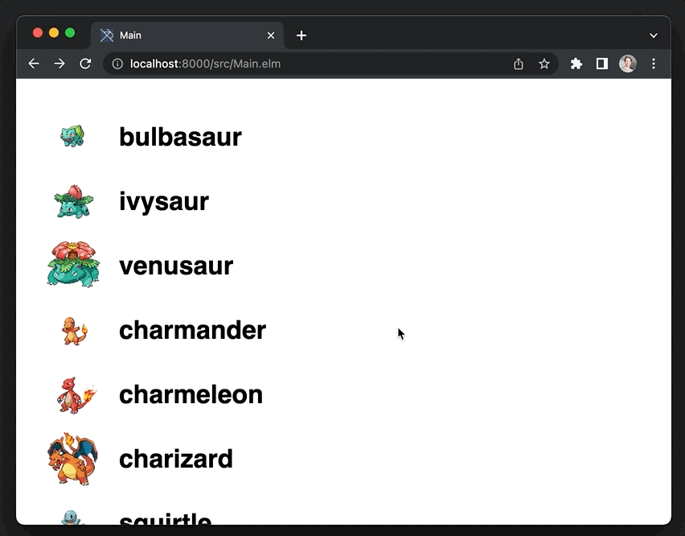

# PokeAPI example

> An example of how to use a real GraphQL API with this package



## Run the example

If you already have [Elm](https://guide.elm-lang.org/install/elm.html), you can run the app with this command:

```
elm reactor
```

The app will be available at `http://localhost:8000/src/Main.elm`

### Using the PokeAPI

This example app uses the free PokeAPI, which enforces a rate-limit of 100 calls per hour.

Please abide by their [Fair Use Policy](https://pokeapi.co/docs/v2#fairuse) to keep this great learning resource available!
